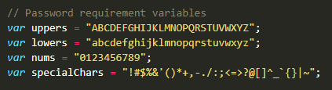
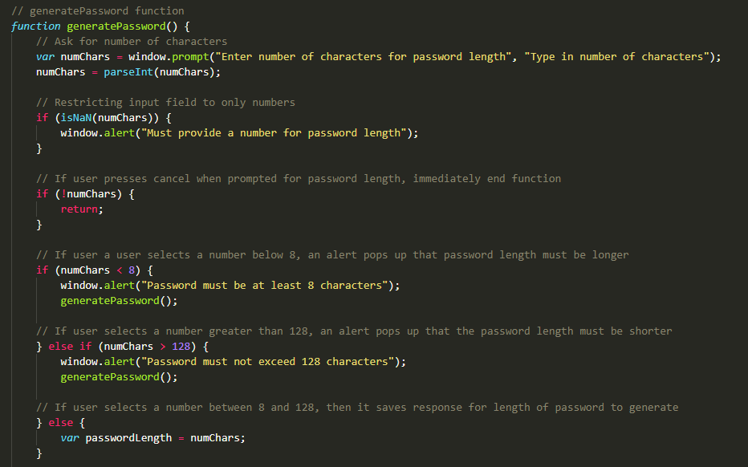
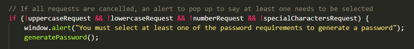
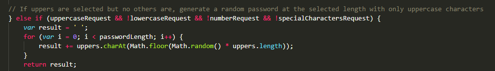
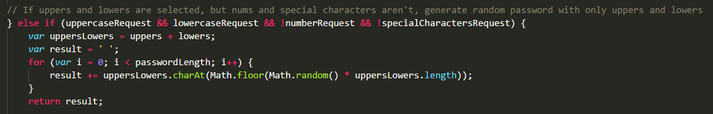

# Secure-password-generator

## Description
This project required the modification of starter code to create an application enabling employees to generate random passwords based on criteria that they've selected.

We were provided with the HTML, CSS and part of the JavaScript. The task: to complete the `generatePassword` function within the JavaScript.

The user story was:

```
AS AN employee with access to sensitive data
I WANT to randomly generate a password that meets certain criteria
SO THAT I can create a strong password that provides greater security
```

The acceptance criteria was based off the functionality of the password generator and included the password needing to be generated after the user clicked the 'Generate Password' button and then selecting criteria (such as password length and the types of characters, including uppercase, lowercase, numbers and special characters). The random password would then be generated on the webpage once the the criteria was selected. There were also certain limitations, including the password needing a minimum of 8 characters and a maximum of 128 characters, and at least one type of character needed to be selected.

> The final project can be found at: https://chardige.github.io/Secure-password-generator/

> The final code can be found at: https://github.com/CharDige/Secure-password-generator

## The process - how I broke down the problem

After creating the GitHub repository and pushing through my initial commit of the HTML, CSS and JavaScript, I did a little bit of research on how to generate random strings of characters on Google, familiarising myself with the process of integrating `for` loops and `Math.floor` `Math.random` properties.

One common solution for this problem was to use a very long variable of all the characters to be randomly selected. However, I knew that this wasn't going to work as the user would be selecting each type of character through a selection process. So, I separated each character type into it's own variable. I made these global variables.



After this, I considered the acceptance criteria and planned out the best sequence of questions for the user when selecting what they needed for their password. I decided on the below:

1. Number of characters
2. Uppercase characters
3. Lowercase characters
4. Numbers
5. Special characters

This was how I planned out the rest of the work I needed to complete, starting with implementing the JavaScript to lock in the password length.

### Password length

I began the creation of the `generatePassword` function by starting with creating the variable `numChars`, which would link to the `window.prompt` property. By using `window.prompt` I could ask the user how many characters they needed for the password length and they could input an answer. I also did a bit of research about only allowing numbers to be inputted into this section and utilised the `parseInt` property.

I included a conditional statement around the user cancelling the process at the beginning, which would return the user to the webpage for them to click the Generate Password button again or leave the page.

I also put in conditional statements to capture the requirement of the password length having a minimum of 8 characters and maximum of 128 characters, using the `window.alert` property to alert users of this requirement.

I tested this functionality with each step, using the `console.log` property, so that when I followed the bouncing ball, it would provide me with the answer I was looking for in the console.




### Types of characters for password generation

This was the part that took me the most time: the conditional statements that would cover each type of character that would be selected and then used within the generated password.

I began with creating four local variables for each kind of character request, which would sit within `window.confirm` properties. Each `window.confirm` property asked a similar question to the user, asking whether they needed a certain type of character, beginning with uppercases, then lowercases, numbers and finally special characters.

By using `window.confirm`, I was keeping the variables as booleans, which would help with the selection criteria.

I began with the conditional statement where all choices were `Cancel` (or '`false`'). This would pop up the `window.alert` that would tell the user they needed to select at least one of the password requirements to generate a password. This then started the process over again, asking the user to input the number of characters for the password length.



This then started the process of putting together the conditional statements that would randomly generate a password depending on the selection of character types. Beginning with only uppercase characters, I removed the exclamation point from the variable `uppercaseRequest`. I then constructed a `for` loop, which pulled on the characters and length of the global `uppers` variable.

This was the first instance of using `Math.floor` and `Math.random` to create a randomly generated password using only uppercase characters. It took a few attempts, and after a bit of research, I was able to get the uppercase-only selection to work and provide a randomly generated password (seen in the following code):



Once this worked, I copied and pasted the code and adjusted each bit of code to suit each type of request with only one of the character types selected.

Then, it was time to organise the code so that the result would be a randomly generated password with two selections and two cancellations. From the research I had done, I noted that some examples created new variables to include different characters as part of the conditional statement and `for` loop. Therefore, I tested a new variable within a conditional statement to try and combine the content within the `uppers` and `lowers` variables. I then used the new variable within the `for` loop. The code can be seen below:



This was successful, so I used this same process for all other selections, whether it was only two selections (uppers and numbers), three selections (lowers, numbers and special characters) or all types of characters selected.

## Final


This can also be viewed at this link: https://chardige.github.io/Secure-password-generator/

And, the HTML, CSS and JavaScript can be viewed in the GitHub repository: https://github.com/CharDige/Secure-password-generator

## Challenges

The challenges I had with this project were mostly involved with the conditional statements and getting the `for` loops to work so that a random password was generated.

Initially, the JavaScript I had created either completely broke the website that I had to close the tab or restart the browser. Then, when I made further adjustments and tested it using `console.log`, it would either say I was using 'undefined terms' or it would list each 'random' letter in it's own separate log rather than as a single log.

With the research I conducted, I noticed the use of creating the variable `result`, then finishing the function with `return` then `result`. I decided to include these aspects to my JavaScript, which provided the results I was looking for.

This research included using W3 Schools, Stack Overflow, and other websites. All of these resources have been cited in the credits section.

## What I learnt

This project really helped me extend my knowledge on how functions work within JavaScript. Before this project, conditional statements and `for` loops, and combining these two properties, were really confusing for me at first. However, the more I tested using the `console.log` function, the more I became confident in implementing these types of properties within JavaScript.

I also learnt a lot about how JavaScript works regarding the sequence in a function. I did a few tests moving some of the functions around, hoping that 'undefined terms' would be picked up where they weren't previously. By moving some of the conditional statements and functions around, I saw how they all interacted with each other and how important the sequence of code is.

## Credits
I referred to a number of websites throughout this assignment to create my final random password generator. I have provided references to these pages below:

W3 Schools (2022), *JavaScript Random*, W3 Schools, https://www.w3schools.com/js/js_random.asp

W3 Schools (2022), *JavaScript String charAt()*, W3 Schools, https://www.w3schools.com/jsref/jsref_charat.asp

W3 Schools (2022), *JavaScript For Loop*, W3 Schools, https://www.w3schools.com/js/js_loop_for.asp

Sergey (2021, June 7), *Generate random string/characters in JavaScript*, Stack Overflow, https://stackoverflow.com/questions/1349404/generate-random-string-characters-in-javascript

Parewa Labs Pvt. Ltd. (2022), *JavaScript Program to Generate Random String*, Programiz, https://www.programiz.com/javascript/examples/generate-random-strings

Sleepy Shrike (2019, December 8), *"javascript random letters and numbers" Code Answer's*, Grepper, https://www.codegrepper.com/code-examples/javascript/javascript+random+letters+and+numbers

RobG (2018, September 28), *Window.prompt accept only numeric values*, Stack Overflow, https://stackoverflow.com/questions/52553230/window-prompt-accept-only-numeric-values

## License

MIT License

Copyright (C) 2022 Charlotte Dige